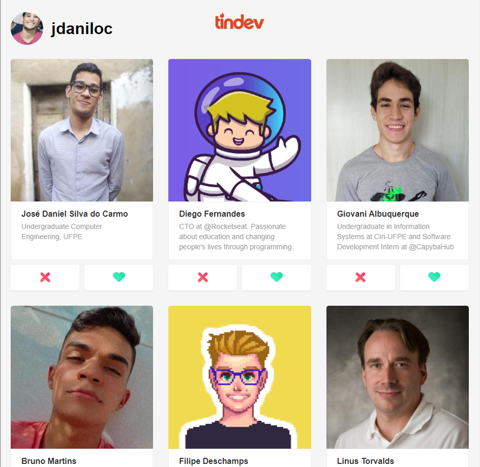

    Tinder copy for devs, implementing backend, frontend and mobile applications

## Technologies

- Express server
- MongoDB database
- ReactJS library
- React Native lib
- Socket IO lib (for realtime applications)

<p align="center">
    
</p>

## Getting started

1. Clone this repo using following the instructions in the green button
2. Move yourself to the directory and make sure you have npm installed
3. Install yarn using `npm install -g yarn`

## How to run the backend

1. Go to backend folder running ` cd backend `
2. Install the dependencies running ` yarn `
3. Create a MongoDB collection and get the URI
4. Create a `.env` file in the root of the project
5. Fill your `.env` with the port and database uri, like:

```py
PORT = 3333
DATABASE = mongodb+srv://
```

6. Finally run `yarn dev`

## How to tun the frontend

1. Go to frontend folder: ` cd frontend `
2. Install the dependencies running ` yarn `
3. Make sure your backend is running and run `yarn start`